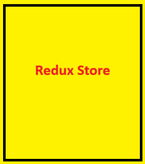
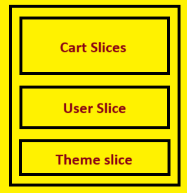

# Let's Build Our Store
## useContext  vs  Redux

`useContext` and `Redux` are both tools used for state management in React applications, but they serve different purposes and have different use cases. Let's explore the key differences between useContext and Redux:

> 💡useContext:

`Scope` : `useContext` is part of the React core and is used for managing state within the component tree. It provides a way to access the value of a context directly within a component and its descendants. It's typically used for smaller-scale state management needs within a component or a small section of the application.

`Complexity` : useContext is simpler and more lightweight compared to Redux. It's a part of the React library and doesn't introduce additional concepts or boilerplate code.

`Component Coupling` : State managed with useContext is local to the component or a subtree of components where the context is provided. This can lead to more isolated and less globally shared state.

`Integration` : It's seamlessly integrated into React and works well with the component lifecycle. You can create and consume contexts within functional components using the useContext hook.

> 💡Redux:

`Scope`: Redux is a state management library that provides a global state container for the entire application. It allows you to manage the application state in a predictable and centralized manner.

`Complexity` : Redux introduces a set of concepts, such as actions, reducers, and a store. This can make it more complex compared to using useContext for local state management.However, it becomes valuable in larger and more complex 
applications.

`Component Coupling` : State managed with Redux is global, which means any component can connect to and access the state. This can be advantageous for sharing state across different parts of the application.

`Integration`: Redux needs to be integrated separately into a React application. You need to create actions, reducers, and a store. Components interact with the global state using the connect function or hooks like useSelector and useDispatch.

>💡Use Cases:

`Use useContext When` : We have smaller-scale state management needs within a component or a local subtree. We want a lightweight solution without introducing additional complexity. Our state doesn't need to be shared extensively across different parts of the application.

`Use Redux When` : We have a complex application with a large state that needs to be shared across many components. We want a predictable state management pattern with a unidirectional data flow. We need middleware for advanced features like asynchronous actions.

> Choose  useContext for simpler and local state management within components or small sections of our application . 

> Choose  Redux for more complex applications where we need a 
global state that can be easily shared across different components .

## Redux 
`Redux is a predictable state container for javascript apps.`

+ Explanation :

    Redux offers state management and it does not need to be a react application itself, it works with other libraries and frameworks as well but it is heavily used with react.

> React and Redux are different libraries.

> Redux is not the only library that is used for managing state, there is a another one as well which is `Zustand`.

`Redux team offers 2 libraries, that are :`

+ React-Redux
+ Redux-Toolkit
---

## Redux Architecture

1. **What is a Redux Store?**
    + Redux store is nothing but a big object and it is kept in a central global place.
    
    *add image*
    + This is a central place and any component can access this redux store inside our application. It can write data & it can read data from that store.
    + We keep the major data of our application into this redux store.

2. **With this big object, our redux store becomes very big & clumsy. So how to handle this?**

    + To handle this, we have something inside our redux store that is known as `Slices`.
    + We can assume a `Slice` to be a small portion of our redux store.
    + We can create multiple slices inside our redux store.
    

3. **Why do we need slices and what are the these slices actually?**

    + Let us take an example of our application in this food ordering app.
    + Let me tell you, what can be slices to keep data separate, we make logical partitions and these logical partitions are slices

    Example :
    
    - So assume that suppose if we want to add card data into redux store, we will create a separate slice for a card data. 
    - suppose if we want to keep logged in user info inside our redux store, So we will create a user slice.
    - theme slice etc.

4. **Can we directly put data into slices?**

    - No, you can't directly add data into slices.
    - You can't directly modify your slices. There is a way we can do that.

    > This is the way to write the data. 

    - 
    understand through this image :
    - When we click on this `add` button, It `dispatches` an `action`, calls a reducer `function` and this reducer function will actually modify the cart slice which updates the slice of our redux store.
    - By this way, our cart slice will have some data inside it. 

5. **What is this function known as?**
    - This function is basically known as a `Reducer`. 
    -

6. **How to read the data?**
    - We use something known as `Selector`. 
    - 
    - when we use selector so this phenomena is known as subscribing to the store. 

7. **What we do if I subscribe to the store?**
    - We say that header component is subscribed to our store. 
    > When I say `Subscribe the store`, basically it is in sync with the store. If the data inside my store changes my header component will update automatically.

8. **How do we subscribe?**
    - Using a Selector.

*REVISE WHOLE THINGS*

+ If you click on this add button, it dispatches an action, which calls a reducer function which updates the slice of the store and because this header component is subscribed to the store using a selector, it will automatically got updated. 
---

## Redux start procedure

- Install two libraries : 
    - @reduxjs/toolkit & react-redux
- Build our store
- Connect our store to our app
- Create a Slice (cartSlice)
- dispatch(Action)
- selector

1.  *Install two libraries* `react-redux` & `@reduxjs/toolkit`.
```
npm i axios react-redux @reduxjs/toolkit
``` 
2. *Configure a store:* Using `configureStore()` function and it comes from redux toolkit.
    - We will add `slices` inside this store.
```
import {configureStore} from "@reduxjs/toolkit"

export const appStore = configureStore({});
```
3. *Connect this store to our application*

    - go to the `App.js`
    - we need to provide our store to our application so we will need a `<Provider></Provider>` from `react-redux`.

    > Note : The configuring store is a redux job and providing it to react application is react-redux job. `React-redux is working like a bridge.` We are providing inside a react application that is why this `Provider` is coming from `react-redux`.

    - we will wrap our whole app under the `Provider` and pass the `store` as props over here.
    - we will pass our store name as `appStore`.

    ```javascript

    // In the App.js
      
    return (
    <>
      <Provider store={appStore}>
          <Header />
          <Outlet />
      </Provider>
    </>
    );
    ```
4. *Create a Slice (cartSlice)*
    - Create a slice using a function known as `createSlice()` 
    - `createSlice()` comes from `@reduxjs/toolkit`
    - this function takes an configuration such as :
        - name : It is a string.
        - initialState : it is an Object, which takes initial state of our slice.
        - reducers : it is also an object. This object has different type of actions. 
            -  What different type of actions could be : 
                - addItem, removeItem etc.
        We can perform all these actions and for each corresponding this, we will have this reducer functions. We will create actions and reducers over here.
        ```javascript
        // This is basically a reducer function with the name  `addItem` but this will map to an action
            addItem: (state, action) => {
            state.items.push(action.payload)
            },
        ```
    - **What is an `action`?**
        - Actions are basically, we can say that it's kind of like small API's, to communicate with redux store. so if you want to add a item, I will dispatch the `addItem`.  

        ```javascript
        import { createSlice } from "@reduxjs/toolkit";

        const initialState = {
        items: [],
        };

        const cartSlice = createSlice({
        name: second,
        initialState,
        reducers: {
            // this addItem, removeItem, clearCart etc key are an action and the value is a reducer function which is mapped to this
            addItem: (state, action) => {
                // Mutating the state here
            state.items.push(action.payload)
            },
            removeItem: (state) => {
            state.items.pop()
            },
            clearCart: (state) => {
            state.items.length = 0;
            }

        },
        });

        export const {addItem, removeItem, clearCart} = cartSlice.actions;

        export default cartSlice.reducer;
        ```
        - This reducer function actually modifies the data inside this slice. this reducer function get 2 parameters a `state` and `action`. Now, It will modify our state based on the action.
        - > *Note : If we don't need action then we can avoid it.*  
    - We export two things `actions` and `reducer`. 
    - Finally, add cart reducer to the appStore.
    
    ```javascript
    import { configureStore } from "@reduxjs/toolkit";
    import cartReducer from "../slices/cartSlice";

    export const appStore = configureStore({
    // This reducer is basically responsible for modify the app store. This reducer is the combination of all small reducer from different slices.
    //  Each slices have it's own reducers.
    reducer: {
        cart: cartReducer,
        // user : userReducer,
    },
    });

    ```
5. **Dispatch(Action)** :
    
    - When somebody clicks on this `add` button , it should `dispatch` an `action` 
    ```javascript
    <button type="submit" onClick={handleAddItem}>
        Add+
    </button>
    ```

    - This `dispatch` is a function that we get from a hook, that is known as `useDispatch()`.
    - This `useDispatch()` hook is comes from `react-redux`.

    ```javascript
    const dispatch = useDispatch();
    ```
    - whenever we will click on this add button, an action is dispatched which calls a reducer function which updates the slice of the store. And because my header is subscribed to the store using a selector, everything is working seamlessly fine.
    - so, in this case, whenever we clicks this add button, it will add pizza to the cart slice.

    ```javascript
    const handleAddItem = () => {
        // dispatch an action
        dispatch(addItem("pizza"));
    };
    ```

    > Important Note : The three variations you provided for the `onClick` event handler in React serve different purposes. Here's a breakdown of each one:

        1. **`onClick={handleAddItem}`**

        This directly assigns the `handleAddItem` function to the `onClick` event. When the element is clicked, `handleAddItem` will be called without any arguments. This is useful when you want to invoke the function with no parameters.

        ```jsx
        <button onClick={handleAddItem}>Add Item</button>
        ```

        2. **`onClick={() => handleAddItem(id)}`**

        This uses an arrow function to invoke `handleAddItem` with the parameter `id`. When the button is clicked, the arrow function runs first, and then `handleAddItem` is called with the specified `id`. This is helpful when you want to pass specific parameters to the function.

        ```jsx
        <button onClick={() => handleAddItem(id)}>Add Item</button>
        ```

        3. **`onClick={handleAddItem(id)}`**

        This immediately invokes `handleAddItem` with the argument `id` when the component is rendered, rather than attaching it as an event handler. As a result, `handleAddItem` will run right away when the component mounts, and you'll likely see unexpected behavior. This is **not the correct way** to set an event handler.

        ```jsx
        <button onClick={handleAddItem(id)}>Add Item</button> // Not recommended
        ```

        ### Summary:

        - **Use `onClick={handleAddItem}`** when you want to call the function without any arguments.
        - **Use `onClick={() => handleAddItem(id)}`** when you want to pass an argument to the function when the button is clicked.
        - **Avoid using `onClick={handleAddItem(id)}`** because it calls the function immediately upon rendering, not upon the click event. 


6. **Selector** : 
    - A selector is nothing but the hook inside a react.
    - This `useSelector()` is a hook that gives us a access to our store.
    - This selector basically helps us to identify what portion of our store I need to read. and We need to subscribe too. 

    ```javascript
    // Subscribing to the store using selector
    const cartItems = useSelector((store) => store.cart.items);
    ```
    Access it as :

    ```javascript
    <Link className="nav-link" to="/cart">
        Cart-({cartItems.length} items)
    </Link>
    ```

    > Very Important Note :
     - Why it's name is `selector` ? 
        - Because you are selecting a portion of the store, that's why it is a selector. So always select a portion of the store rather than selecting a whole store.
        or 
        So you are subscribing to the selected portion of the store.

        ```javascript
        // Correct way : When you will write like this, cart items will only update when my `store.cart.items` change that small items, it has nothing to do with anything happening outside the scope of this. 
        //`It is only subscribed to cart items.`   
          const cartItems = useSelector((store) => store.cart.items);
        
        // Wrong way
          const store = useSelector((store) => store);
          const cartItems = store.cart.items
        ``` 

---

1. **Advantages of using  Redux Toolkit over Redux ?**

    `Redux Toolkit` is a set of utility functions and abstractions that simplifies and streamlines the process of working with Redux. It is designed to address some of the common pain points and boilerplate associated with using plain Redux. 
    
    Here are some advantages of using Redux Toolkit over plain Redux:

    `Less Boilerplate Code` : Redux Toolkit helps us write less code. It provides shortcuts that save us from typing a lot of repetitive and verbose code, making our Redux logic cleaner and more concise.

    `Easier Async Operations` : If our app deals with things like fetching data from a server, Redux Toolkit makes it simpler. It has a tool called `createAsyncThunk` that handles async actions in a way that's easy to understand and use.

    `Simpler Store Setup`: Setting up your Redux store is easier with Redux Toolkit. It has a function called configureStore that simplifies the process, and it comes with sensible defaults, so you don't have to configure everything from scratch.

    `Built-in DevTools Support`: If you use Redux DevTools for debugging, Redux Toolkit has built-in support. Enabling it is as easy as adding one line of code when setting up your store.

    `Encourages Best Practices`: Redux Toolkit is recommended by the official Redux documentation. It encourages you to follow best practices in Redux development, making sure your code is more maintainable and aligns with industry standards.

    `Handles Immutability for You`: Working with immutable data (making sure you don't accidentally change your data) is usually a bit tricky. Redux Toolkit uses a library called Immer to handle this behind the scenes, so you can write more 
    straightforward and readable code.

    `Backward Compatibility`: If you already have a Redux app, you can slowly transition to Redux Toolkit without rewriting everything. It's designed to be compatible with your existing Redux code.

    `Faster Development`: With Redux Toolkit, you can get things done more quickly. You spend less time setting up and configuring Redux and more time focusing on building features for your app.

    In simple terms, Redux Toolkit is like a set of tools that makes working with Redux easier. It simplifies common tasks, reduces the amount of code you need to write, and encourages good coding practices. If you're starting a new project or thinking about improving an existing one, Redux Toolkit can save you time and make your life as a developer more enjoyable.

2. **Explain  Dispatcher ?**

    > In Redux, a `dispatcher` is not a standalone concept; instead, it's a term often used to refer to a function called dispatch. The dispatch function is a key part of the Redux store, and it plays a crucial role in the Redux data flow.

    > 💡Here's a breakdown of the dispatch function and its role in Redux:

    1. `Dispatch Function`: The dispatch function is provided by the Redux store. We use it to send actions to the store. An action is a plain JavaScript object that describes what should change in the application's state.
    2. `Usage`: When we want to update the state in our Redux store, we create an action and dispatch it using the dispatch function.
    
        ```
        const myAction = { type: 'INCREMENT' };
        store.dispatch(myAction);
        ```
    + Here, the  INCREMENT  action is an example. The dispatch function is responsible for sending this action to the Redux store.

    3. `Middleware`: The dispatch function is also a crucial point in the Redux middleware chain. Middleware can intercept actions before they reach the reducer or modify 
    actions on the way out. Middleware functions receive the dispatch function, allowing them to either pass the action along or stop it.
    4. `Redux Store`: The dispatch function is a core method provided by the Redux store. When an action is dispatched, the store passes the action through its reducer, which is a function that specifies how the state should change in response to the action.
    5. `Asynchronous Actions`: Redux supports asynchronous actions using middleware like redux-thunk or redux-saga. The dispatch function allows you to handle asynchronous operations by dispatching actions inside functions (thunks) and handling those actions asynchronously.
    
    > 📌Here's an example of how you might use dispatch in a React component:
    
    ```
    import { useDispatch } from 'react-redux';
    const MyComponent = () => {
        const dispatch = useDispatch();
    const handleButtonClick = () => {
        // Dispatching an action to increment the count
        dispatch({ type: 'INCREMENT' });
    };
    return (
        <button onClick={handleButtonClick}>
        Increment Count
        </button>
    );
    };
    ```
    In this example, the `useDispatch` hook from react-redux gives us access to the dispatch function, which we then use to send an action to the Redux store when the button is clicked. This action will be processed by the reducer, updating the state accordingly.

3. **Explain  Reducer ?**

    > In Redux Toolkit, the  createSlice function is commonly used to create reducers . It simplifies the process of defining actions and the corresponding reducer logic, reducing boilerplate code. Let's break down the key concepts related to creating reducers with createSlice in Redux Toolkit :
    
    1. `Creating a Slice`: Instead of creating a standalone reducer function, you use createSlice to define a "slice" of your Redux store. A slice includes actions, a reducer, and the initial state.

    ```
    import { createSlice } from '@reduxjs/toolkit';
    const counterSlice = createSlice({
    name: 'counter',
    initialState: { value: 0 },
    reducers: {
        increment: (state) => {
        state.value += 1;
        },
        decrement: (state) => {
        state.value -= 1;
        },
    },
    });
    // Extracting actions and reducer from the slice

    export const { increment, decrement } = counterSlice.actions;
    
    export default counterSlice.reducer;
    ```
    2. `Automatically Generated Action Creators`:`createSlice` automatically generates action creators for each reducer function. In the example above, increment and decrement are automatically created and exported for use in your components.

    3. `Immutability with immer`: Redux Toolkit uses the immer library internally to handle immutability. This means you can write reducer logic that appears to directly modify the state, but immer ensures it produces a new state without mutating the original.
    ```
    reducers: {
    increment: (state) => {
        state.value += 1;  // Immer takes care of creating a new 
    state
    },
    },
    ```
    4. `Reducer Function`: The createSlice function returns an object that includes a reducer property. This reducer is a function that you can use in your store's configuration.

    ```
    const rootReducer = combineReducers({
    counter: counterSlice.reducer,
    // ... other reducers
    });
    ```
    5. `Initial State`: The initialState property in createSlice defines the initial state of your slice. This is the starting point for your state before any actions are dispatched.
    6. `Reducer Logic`: The logic inside each reducer function specifies how the state should change in response to the associated action. In the example, the increment and decrement reducers modify the value property of the state.

    7. `Simplifying Reducer Composition`: With createSlice, we can easily compose reducers using combineReducers or by directly adding the slice's reducer to the root reducer. This simplifies the overall reducer composition in our application.

    Using createSlice in Redux Toolkit streamlines the process of defining reducers, actions, and initial states, making your Redux code more concise and readable. It encourages best practices, such as immutability and simplicity, while reducing the boilerplate traditionally associated with Redux.

4. **Explain  Slice ?**

    > In Redux Toolkit, a `slice` is a collection of Redux-related code, including reducer logic and actions, that corresponds to a specific piece of the application state. 
    Slices are created using the createSlice utility function provided by Redux Toolkit. The primary purpose of slices is to encapsulate the logic related to a specific part of the state, making the code more modular and easier to manage.

    > 🛠 Here's a breakdown of key concepts related to slices in Redux Toolkit:

    **Creating a Slice: The createSlice function takes an options object with the following properties:**

    1. `name (string)`: A string that identifies the slice. This is used as the prefix for the generated action types.
    ```
    import { createSlice } from '@reduxjs/toolkit';
    const mySlice = createSlice({
    name: 'mySlice',
    initialState: { /* ... */ },
    reducers: {
        // ...reducers
    },
    });
    ```
    2. `initialState (any)`: The initial state value for the slice. This is the starting point for your state before any actions are dispatched. 
    3. `reducers (object)`: An object where each key-value pair represents a reducer function. The keys are the names of the actions, and the values are the corresponding reducer logic.
    ```
    const mySlice = createSlice({
    initialState: { /* ... */ },
    reducers: {
        increment: (state) => {
        state.value += 1;
        },
        decrement: (state) => {
        state.value -= 1;
        },
    },
    });
    ```
    **Output: The createSlice function returns an object with the following properties:**
    `name (string)`: The name of the slice.  
    `reducer (function)`: The reducer function generated based on the provided reducers. This is the function you use in your store configuration.  
    `actions (object)`: An object containing the action creators for each defined reducer. These action creators can be directly used to dispatch actions.

    ```
    const { increment, decrement } = mySlice.actions;
    ```
    **Using a Slice: Once we've created a slice, you can use its reducer and actions in your Redux store configuration and in your React components.**

    1. `Configuring the Store`: We can include the generated reducer in your store configuration.
    ```
    import { configureStore } from '@reduxjs/toolkit';
    import mySliceReducer from './path/to/mySlice';

    const store = configureStore({
    reducer: {
        mySlice: mySliceReducer,
        // ...other reducers
    },
    });
    ```
    2. `Dispatching Actions`: In our React components, we can use the generated action creators to dispatch actions.
    ```
    import { useDispatch } from 'react-redux';
    import { increment } from './path/to/mySlice';
    const MyComponent = () => {
    const dispatch = useDispatch();
    const handleIncrement = () => {
        dispatch(increment());
    };
    // ... rest of the component logic
    };
    ```
    Using `slices in Redux Toolkit promotes a modular and organized approach to state management.` Each slice encapsulates the logic related to a specific part of the state, making it easier to understand, maintain, and scale your Redux code.

5. **Explain  Selector ?**

    > In Redux Toolkit, a  selector  is a function that extracts specific pieces of data from the Redux store. It allows you to compute derived data from the store state and efficiently access specific parts of the state tree. Selectors play a crucial role in managing the state in a clean and efficient way.

    Redux Toolkit provides the createSlice createAsyncThunk utilities along with the createSelector function from the reselect library to help manage selectors easily.

    > 📢Here's an explanation of how selectors work in Redux Toolkit:
    
    1. `Defining Selectors with createSlice`: When we create a slice using createSlice, we can include selectors in the extraReducers field. These selectors can compute and return specific pieces of data from the state.

    ```
    import { createSlice } from '@reduxjs/toolkit';

    const mySlice = createSlice({
        name: 'mySlice',
        initialState: { data: [] },
        reducers: {
            // ...reducers
        },
        extraReducers: (builder) => {
            builder
            .addCase(otherSliceAction, (state, action) => {
                // logic for handling other slice's action
            })
            .addDefaultCase((state, action) => {
                // default logic for handling actions not handled by 
        this slice
            });
        },
        selectors: (state) => ({
            // selector functions here
            selectData: () => state.data,
            selectFilteredData: (filter) => state.data.filter(item => 
        item.includes(filter)),
        }),
        });
        export const { selectData, selectFilteredData } = mySlice.selectors;
    ```

    2. `Using Reselect with createSlice`: If we need more advanced memoization and composition of selectors, you can use the createSlice function along with the reselect library.
    ```
    import { createSlice, createSelector } from '@reduxjs/toolki
    t';
    const mySlice = createSlice({
    // ... other options
    selectors: {
        selectData: (state) => state.data,
        selectFilteredData: createSelector(
        (state) => state.data,
        (_, filter) => filter,
        (data, filter) => data.filter(item => item.includes(fil
    ter))
        ),
    },
    });
    export const { selectData, selectFilteredData } = mySlice.selectors;
    ```

    3. `Using Selectors in Components`: Once we've defined selectors, we can use them in your React components using the useSelector hook from the react-redux library. This hook allows you to efficiently extract and subscribe to parts of the Redux store.

    ```
    import { useSelector } from 'react-redux';
    import { selectData, selectFilteredData } from './mySlice';
    const MyComponent = () => {
    const data = useSelector(selectData);
    const filteredData = useSelector(state => selectFilteredDat
    a(state, 'someFilter'));
    // ... rest of the component logic
    };
    ```
    Selectors help keep your state management logic clean and efficient by allowing us to centralize the computation of derived data from the Redux store. They contribute to better organization, improved performance, and easier maintenance of our Redux code.

6. **Explain  _createSlice_  and the configuration it takes?**

    `createSlice` is a utility function provided by Redux Toolkit that simplifies the `process of creating Redux slices.` A `Redux slice is a piece of the Redux store that includes a set of actions, a reducer, and an initial state.` The createSlice function helps reduce boilerplate code associated with defining actions and the reducer for a specific slice of your Redux store.

    > Here's an explanation of the configuration options that createSlice takes:
    
    > 📢Syntax:
    ```
    createSlice(options)
    ```
    > 📢Configuration Options:
    1. `name (string)`: A string that identifies the slice. This is used as the prefix for the generated action types.
    ```
    const mySlice = createSlice({
    name: 'mySlice',
    // ... other options
    });
    ```
    2. `initialState (any)`: The initial state value for the slice. This is the starting point for your state before any actions are dispatched.
    ```
    const mySlice = createSlice({
    initialState: { value: 0 },
    // ... other options
    });
    ```

    3. `reducers (object)`: An object where each key-value pair represents a reducer function. The keys are the names of the actions, and the values are the corresponding reducer logic.
    ```
    const mySlice = createSlice({
    reducers: {
        increment: (state) => {
        state.value += 1;
        },
        decrement: (state) => {
        state.value -= 1;
        },
    },
    // ... other options
    });
    ```
    4. `extraReducers (builder callback)`: A callback function that allows you to define additional reducers outside of the reducers field. It is called with a builder object 
    that provides methods for adding reducers based on other action types.
    ```
    const mySlice = createSlice({
    extraReducers: (builder) => {
        builder
        .addCase(otherSliceAction, (state, action) => {
            // logic for handling other slice's action
        })
        .addDefaultCase((state, action) => {
            // default logic for handling actions not handled by 
    this slice
        });
    },
    // ... other options
    });
    ```
    5. `slice (string)`: An optional string that specifies a slice of the state to be used with the createAsyncThunk utility. This is useful when working with asynchronous actions.
    ```
    const mySlice = createSlice({
    slice: 'myAsyncSlice',
    // ... other options
    });
    ```
    6. `extraReducers (object)`: An alternative way to define extra reducers using an object directly. Each key an action type, and the value is the corresponding reducer function.
    ```
    const mySlice = createSlice({
    extraReducers: {
        [otherSliceAction.type]: (state, action) => {
        // logic for handling other slice's action
        },
        // ... additional action types
    },
    // ... other options
    });
    ```
    > ⚙ Output :
    
    The createSlice function returns an object with the following properties:
    
    `name (string)`: The name of the slice.  
    `reducer (function)`: The reducer function generated based on the provided reducers and extraReducers. This is the function you use in your store configuration.  
    `actions (object)`: An object containing the action creators for each defined reducer. These action creators can be directly used to dispatch actions.
    ```
    const { increment, decrement } = mySlice.actions;
    ```

    These are the main configuration options for createSlice in Redux Toolkit. It provides a convenient way to define actions, reducers, and initial states for slices of our Redux store, reducing the amount of boilerplate code and promoting best practices.


# Interview purpose
1. **Confusing between `reducer` keyword from store to slice, Clear it out**

    **In the `store`**

    Reducer is the combination of all small reducer. So, in the store we only use `reducer` as singular noun.

    ```javascript
    reducer: {
        cart: cartReducer,
    },
    ```
    **In the `Slice`**

    In the slice, there are multiple `reducer functions` so we use plural noun as `reducers` but `export` in singular noun as `reducer`.  

    ```javascript
    // reducer functions
    reducers: {
        addItem: (state, action) => {
        // mutating the state here
        state.items.push(action.payload);
        },
        removeItem: (state) => {
        state.items.pop();
        },
        clearCart: (state) => {
        state.items.length = 0;
        },
    },
    ```

    ```javascript
    // exporting reducer
    export default cartSlice.reducer;
 
   ```
2. **Redux**

    - In the older version of Redux, Redux used to say, never mutate the state and returning was mandatory.Basically, we used to return the new state. 
    - But in the latest Redux Toolkit, We have to mutate the state and we don't have to return anything.  
    > Behind the scenes, Redux is actually doing something like this.
    Redux uses something known as `Immer` Library to do this.
    So, Basically Immer library is kind of like finding the difference between the original state, the mutated state and then gives us back the new State, Which is an immutable state, a new copy of the state. 

    ```javascript
    reducers: {
    addItem: (state, action) => {
      // Vanilla(Older) Redux => DON'T MUTATE STATE
      // const newState = [...state]
      // newState.items.push(action.payload);
      // return newState;

      // Redux Toolkit
      // We HAVE to mutate the state
      // mutating the state here
      state.items.push(action.payload);
    },
    removeItem: (state) => {
      state.items.pop();
    },
    ```

3. **Do not directly modify the state**
    Example :
    ```javascript
    clearCart: (state) => {
        // Correct way 
        state.items.length = 0;
        // or
        // whatever you return from your reducer function, it will replace whatever is there in original state.
        // If you return over here, you will have to return full state from here. 
        return {items : []}; // this new object will be replaced inside original state.

        // Wrong way 
        // state = ["Aditya"]
    },
    ```
    - If you will make the state empty by using `wrong way`, It won't work because you are not modifying / mutating the state, you are just changing the reference to it. 
    - So in this case, If you have to make it empty, you have to actually mutate the state and we can mutate the state by using `correct way` 
    - RTK says either mutate the existing state or return the new state.

4. **What is the way to check the state in the `console.log()`?**
    - If you have to check the state in the `console.log()` then use `current()` function from `@reduxToolkit`. 
    ```javascript
    clearCart: (state) => {
         // console.log(state)  it won't work , try below one.
        console.log(current(state))
        state.items.length = 0;
    },
    ```