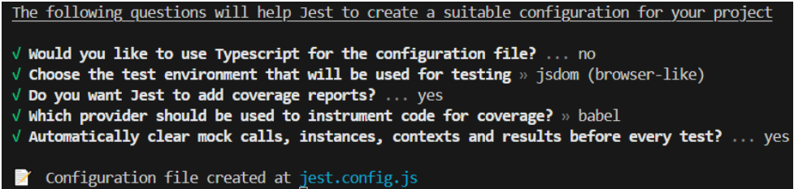
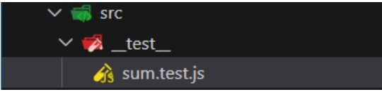
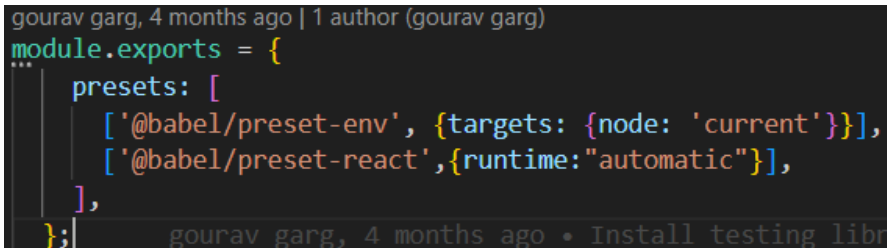
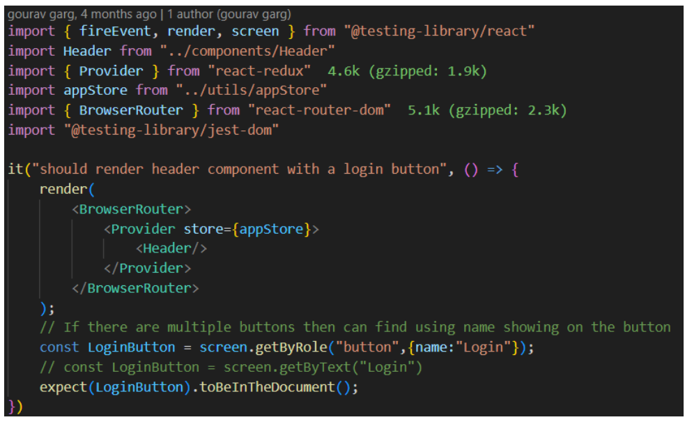

# Time for Test
## Types of testing:
1. **Manual testing:** Testing the functionality that we have 
developed. E.g → we have developed a search bar, manual 
testing is checking the search bar manually by searching the 
query.

    💡This is not a very efficient way because we can’t test 
    every new feature in a big application. A single line can 
    introduce bugs in our whole app because multiple 
    components are connected to each other.

2.  **Automatic testing:** We can write the test cases for testing the functionality. It includes

    a. **Unit Testing:** This involves writing test cases for specific, isolated components of the application. The goal is to verify that individual functions or methods work as intended.

    b. **Integration Testing:** This type of testing is focused on the interaction between components. It checks the interactions between integrated units/modules to ensure they work together correctly. For example, testing the connection between the menu page and the cart page. 

    c. **End-to-End Testing:** This involves writing test cases that simulate real user scenarios from the moment a user enters the website until they leave. It ensures that the overall flow of the application functions as expected, covering multiple components and their interactions. 
    It requires different types of tools such as *Cypress, puppeteer, Selenium etc*

# Install libraries:

> 📢NOTE: If you are using create-react-app or vite. please 
ignore these installation steps because these packages 
already include the testing library

1. **React Testing library:** It is provided by react that allows to test react components. *React Testing library is build on top of DOM TESTING LIBRARY.*  
```
npm i -D @testing-library/react
```
2. **jest:**  Jest ia a standard to write test cases whenever it comes to javascript. It is basically a javascript testing framework and that DOM testing library or React Testing library uses jest behind the scenes.

- React testing library uses jest so we need to install it.
```
npm i -D jest
``` 
Since we are using Babel as a bundler so we need to install some extra libraries.

For more details check the official website: https://jestjs.io/ and https://babeljs.io/docs/usage

3. install extra babel libraries
```
npm install --save-dev @babel/core @babel/cli @babel/preset-env
```
4. create babel.config.js
```
const presets = [
  [
    "@babel/preset-env",
    {
      targets: {
        edge: "17",
        firefox: "60",
        chrome: "67",
        safari: "11.1",
      },
      useBuiltIns: "usage",
      corejs: "3.6.4",
    },
  ],
];
module.exports = { presets };
```
> 📢NOTE: If you are following this series, then you must 
know parcel is using Babel. We just added babel.config 
file but the parcel also has a babel configuration behind 
it. that creates a conflict. To solve this we have to 
disable the parcel config. Create a .parcel.rc file

```
// .parcel.rc
{
  "extends": "@parcel/config-default",
 "transformers": {
    "*.{js,mjs,jsx,cjs,ts,tsx}": [
      "@parcel/transformer-js",
      "@parcel/transformer-react-refresh-wrap"
    ]
  }
}
```
To check that you have installed successfully without an error. 

Try to run the testcase

> **npm run test** →  will give no test case found

5. Let’s configure the jest 
```
npx jest --init // executing the jest package 
```
After running this command, you have to select some options 



> 💡We are using jsdom as a test environment. When we run 
test cases, there is no browser or server. For running 
the test cases we need an environment which is jsdom

6. Install jsdom environment
```
npm install --save-dev jest-environment-jsdom
```

## Start writing testcases:
Let’s start with writing testcases for simple function that 
returns the sum of two numbers

1. create a file for which we need to write the test case
```
//sum.js
export const sum  = (a,b) => {
return a + b;
}
```
2. create a folder __test__ and create a file in this folder 
**sum.test.js**


>Note : This double underscore ( __ ) before and after in test folder known as dunder. We use it as reserved word.

3. Let’s write out first test case

Syntax :
```
test(" ", ()=>{

})
First argument is string that means description of the test, 
Second argument is callback function that means we actually write the implementation of the test cases.
```
Example: 
```
import {sum} from "../components/sum"
test("Function should calculate the sum of two numbers",() => {
const result = sum(3,4) // call the function
expect(result).toBe(7)  // assertion provided by jest. I
}
// test will take two arg name and callback function
```
if there is error in terminal such as :
```
Expected : 5 *expected* means what I have written in expected.
Received : 7 *received* means what I have get from function, so always try to get *received* in *expected*
```

4.  Run the test case using command :
```
npm run test
```
I hope now you have the overview that how testing works. So now let’s write the original test case for our project.

## Unit test: 

**Render :**
Whenever you are testing a UI component inside React, you will have to **render** that component onto the JS DOM first of all.
```
Example :
render(<Contactus />) 
```

**Screen :** 
Screen is an object which comes from "React testing Library". 
Whatever we will *render* , will get access through *screen*.

```
<!-- heading is h1 in contactus component. -->
const header = screen.getByRole("heading")
```

---
Let’s write a test case to check the component is loading or 
not. To check any component loads or not, we need to check in 
the jsdom. 
```
test('check component loads or not',() => {
render(<Contactus/>   // render the component that want 
    const heading = screen.getByRole("heading")  // check the sp
expect("heading").toBeInTheDocument()   // check heading
})
```
> 📢Note: If you are using parcel, you will encounter an 
error. The error is we haven’t enable JSX yet. So, we are 
not able to render the compoent that uses JSX. Let’s 
enable it

To enable JSX in testing environment:
+ a. install babel: npm i -D @babel/preset-react
    > @babel/preset-react is helping our testing library to convert JSX code to HTML. So it can read properly.
+ b.  set babel config:



> 📢Note: Install one more library to use the dom functions
>  + npm i -D @testing-library/jest-dom

Now, run the testcase. It will pass

We found the heading using “getByRole”. But we can also find 
using different functions like
```
const button = screen.getByText("submit") // It will find the te
expect(button).toBeInTheDocument()
```

> Whenever we have to check something whether it has loaded or not in the DOM then we use funtion **toBeInTheDocument()**

**Note :** 
1. for testing single thing/item , we can use **getBy...**.
2. for testing multiple item of same thing such as "*input*" , we can use **getAll...**.
3. we use *getByRole* for *input* as **textbox**.
4. *getBy..*, *getAllBy..* are all these called a querying.

```
if error is something like this :
+ Received has type:  array,
+ Received has value: [`<input class="border rounded-5 border-black my-2 p-2" id="" name="name" placeholder="name" type="text" />, <input class="border rounded-5 border-black my-2 p-2" id="" name="message" placeholder="message" type="textarea" />`]*

then test using **length** property:

test("should load multiple headings inside the contact us component", () => {
  render(<ContactUs />);

  // Querying
  let heading = screen.getAllByRole("heading");

  // Assertion
  expect(heading.length).toBe(3); 
});
```
> 💡We can use **it** instead of **test** keyword, both are same things.

To write multiple testcases

**describe()** : - Group these multiple test cases into a single block that block is known as `describe()`. We can also nesting this describe() into describe().  

```
describe('To test the header component',() => {
it("Should load the header component",() => {})
it("Should include the button",() => {})
}
```

> 💡After creating testcase, git will show many files 
changed. We don’t need to upload the coverage folder to 
the github. So, add **coverage** to the **.gitignore** file

**Let’s make one more test case for testing Header to 
check button is rendered or not
**
```
// import render and header 
it("should test header compoenent",() => {
render(<Header/>)
}
```
We will get a few Errors because we are testing the isolated 
component.

> 📢Note: We used redux store in the header (useSelector) but 
the store is provided to the app component. To test the 
Header component, we need to provide the store to Header 
component as well

> 📢Note: We used the Link component provided by react-
router-dom. But we have provided router to the App 
component. So, To test the Header we have to provide the 
router to the Header component

>If you encounter an error related to the router, such as "error occurred in `<Link>`", it indicates that the error originates from the router. In this case, you'll need to wrap your component with `<BrowserRouter></BrowserRouter>`.

>Similarly, if you receive an error from the react-redux library, such as when using useSelector(), it means you need to provide a Redux store. You can do this by wrapping your component in `<Provider store={yourStore}></Provider>`.

> In regex, We don't need to write exact string.
Example : 
```
const cartText = screen.getByText(/cart/i);
expect(cartText).toBeInTheDocument();
```

> Below image describe : 
 + how to use store for testing if we are using react-redux in the project.
 + Also react router if we use.



To check the button click, you can use the fireEvent which 
behaves like an onclick method 

1. If there were multiple buttons on the screen, but I want specifically the button which has name as "login" (you can pass any name in place of login) then only get me. So how we can achieve this ?

    + we can achieve this by pass extra object with querying. 
    
    Example : 
    ```
    const loginButton = screen.getByRole("button", {name : "login"})

    expect(loginButton).toBeInTheDocument()
    ```
**fireEvent**
---

+ when we need to test such as an event then we use *fireEvent*

Example : 

```
const loginButton = screen.getByRole("button", {name : "login"})

fireEvent.click(loginButton)

const logButton = screen.getByRole("button", {name : "logout"})

expect(logButton).toBeInTheDocument()
```

## Mock Data/ Image/ Css style

1. **Data :**

    For mocking data , we need to use same "props" name inside test file, which we are using in component.

    Example : *resData* is the props name which we were using in the component.

    ```
    render(<RestaurantCard resData={Mock_Data} />)
    ```
    Now, procedure for creating a mock data for testing

    *Steps :* 
    
    + create a folder name with** __mocks__** (add underscore 2 times before and after of *mocks*)
    + create a file inside the *mocks* folder with anyName such as **"resCardMock.json"**
    + copy and paste data such as :
        ```
        {
            id : 1039,
            res_name : "Lemon Chilli",
            ...etc
        }
        ```
    + import the mock data such as :
        ```
        // there is no specific name for importing so use this and should be all in Capital letters.

        import MOCK_DATA from "../mocks/resCardMock.json"
        ```
    + Now run the test 

        Full Example :  
        ```
        it("should render RestaurantCard component with props data", ()=>{

        render(<RestaurantCard resData={Mock_Data} />)

        const name = screen.getByText("Lemon Chilli")

        expect(name).toBeInTheDocument();

        })
        ```


2. **Image & Css Style:**

    ### 1. Directory Structure

    Here’s a recommended directory structure for your project, specifically focusing on where to place your mocks:

    ```
    /your-project-root
    |-- /src
    |   |-- /__mocks__             // Mocks directory inside src
    |   |   |-- fileMock.js        // Mock file for images
    |   |   |-- styleMock.js       // Mock file for CSS
    |   |-- /media
    |   |   |-- logo.png           // Your logo image or other media files
    |   |-- YourComponent.js
    |-- package.json
    |-- jest.config.js             // Jest configuration file (if applicable)
    ```

    ### 2. Mock File for Images (`fileMock.js`)

    Create a mock file for images to ensure that Jest can handle imports like PNG, JPG, etc. Here is how `fileMock.js` should look:

    ```javascript
    // src/__mocks__/fileMock.js

    module.exports = 'test-file-stub'; // A placeholder string for image imports
    ```

    ### 3. Mock File for CSS Styles (`styleMock.js`)

    Create a mock for your CSS files. This allows you to test your components without loading the actual styles:

    ```javascript
    // src/__mocks__/styleMock.js

    module.exports = {}; // An empty object for style imports
    ```

    ### 4. Jest Configuration

    Now, you need to configure Jest to use these mock files when it encounters CSS or image imports. Here’s how to do that in your `jest.config.js` file:

    ```javascript
    // jest.config.js

    module.exports = {
        moduleNameMapper: {
            '\\.(css|less|scss|sass)$': '<rootDir>/src/__mocks__/styleMock.js',  // Map CSS styles
            '\\.(gif|ttf|eot|svg|jpg|jpeg|png)$': '<rootDir>/src/__mocks__/fileMock.js', // Map image files
        },
        // You can add other configurations here as needed
        testEnvironment: 'jsdom', // Recommended for React components
    };
    ```

    #### If you are using `package.json` for Jest configuration:

    ```json
    {
    "jest": {
        "moduleNameMapper": {
        "\\.(css|less|scss|sass)$": "<rootDir>/src/__mocks__/styleMock.js",  // Map CSS styles
        "\\.(gif|ttf|eot|svg|jpg|jpeg|png)$": "<rootDir>/src/__mocks__/fileMock.js" // Map image files
        },
        "testEnvironment": "jsdom" // Recommended for React components
    }
    }
    ```

    ### 5. Example Component Usage

    Here’s how you might use an image and a CSS import in your React component:

    ```javascript
    // src/YourComponent.js

    import React from 'react';
    import './YourComponent.css'; // Importing a CSS file
    import logo from '../media/logo.png'; // Importing an image

    const YourComponent = () => {
        return (
            <div className="your-component-class">
                <h1>Welcome to Your Component</h1>
                
            </div>
        );
    };

    export default YourComponent;
    ```

    ### 6. Running Your Tests

    With the mocks and Jest configuration set up, you can now run your Jest tests without encountering errors related to CSS or image imports.
---

### **Mocking :**

Mocking in testing, especially with tools like Jest, is a crucial skill for ensuring your tests run consistently and accurately without relying on real external data or services. Mocking allows you to isolate components and simulate various conditions your code may encounter. Below is a comprehensive guide to mocking various elements in your application, including data, functions, modules, and more.

### What Is Mocking?

**Mocking** refers to creating a **substitute or a fake** implementation of a piece of code (such as a function, class, or module) that simulates behavior of the original code without executing the real implementation. This allows you to focus on testing your unit of code rather than dealing with side effects or complexities of external systems.

### Common Uses of Mocking

1. **External Services**: Mock API calls to external services to return controlled responses.
2. **Modules**: Mock module imports to prevent executing their code during tests.
3. **Utilities**: Mock utility functions to control their outputs.
4. **Components**: Mock child components to isolate the behavior of parent components.
5. **Data**: Mock any data that may change over time or is difficult to set up.

### Mocking APIs and Data

When working with API calls, you'll use mocking to simulate network requests. Here’s how to do that effectively:

#### Step 1: Use a Mocking Library

You can use libraries like **`jest.mock`** to create mocks. If you are fetching data from an API, you will typically use mocks in your tests to return controlled responses.

#### Example of Mocking API Calls

Imagine you have a component that fetches data from an API:

```javascript
// SampleComponent.js
import React, { useEffect, useState } from 'react';

const SampleComponent = () => {
    const [data, setData] = useState(null);
    
    useEffect(() => {
        fetch('https://api.example.com/data')
            .then(response => response.json())
            .then(data => setData(data));
    }, []);
    
    if (!data) return <div>Loading...</div>;
    
    return <div>{data.title}</div>;
};

export default SampleComponent;
```

You would want to mock the API call when testing this component:

```javascript
// SampleComponent.test.js
import React from 'react';
import { render, waitFor } from '@testing-library/react';
import SampleComponent from './SampleComponent';

// Mock the fetch API
global.fetch = jest.fn(() =>
    Promise.resolve({
        json: () => Promise.resolve({ title: 'Mocked Data Title' }), // Mocked response
    })
);

test('renders with fetched data', async () => {
    const { getByText } = render(<SampleComponent />);
    
    await waitFor(() => expect(getByText(/mocked data title/i)).toBeInTheDocument());
});
```

### Mocking Utility Functions

If you’re importing utility functions that your components rely on, you can mock them similarly:

#### Example Utility Function

```javascript
// utils.js
export const calculateSum = (a, b) => a + b;
```

You can mock this function in your tests as follows:

```javascript
// Component that uses the utility function
// SumComponent.js
import React from 'react';
import { calculateSum } from './utils';

const SumComponent = ({ a, b }) => {
    const sum = calculateSum(a, b);
    return <div>Sum: {sum}</div>;
};

export default SumComponent;
```

#### Mocking the Utility Function

```javascript
// SumComponent.test.js
import React from 'react';
import { render } from '@testing-library/react';
import SumComponent from './SumComponent';
import * as utils from './utils';

// Mock the calculateSum function
jest.mock('./utils', () => ({
    calculateSum: jest.fn(),
}));

test('renders with mocked sum', () => {
    utils.calculateSum.mockReturnValue(10); // Mock return value
    const { getByText } = render(<SumComponent a={3} b={7} />);
    
    expect(getByText(/Sum: 10/i)).toBeInTheDocument();
});
```

### Mocking Child Components

You may want to mock child components to isolate your tests, especially if the child component has its own dependencies:

#### Example Parent Component

```javascript
// ParentComponent.js
import React from 'react';
import ChildComponent from './ChildComponent';

const ParentComponent = () => {
    return (
        <div>
            <h1>Parent Component</h1>
            <ChildComponent />
        </div>
    );
};

export default ParentComponent;
```

#### Mocking the Child Component

```javascript
// ParentComponent.test.js
import React from 'react';
import { render } from '@testing-library/react';
import ParentComponent from './ParentComponent';

// Mock the ChildComponent
jest.mock('./ChildComponent', () => () => <div>Mocked Child</div>);

test('renders ParentComponent with mocked ChildComponent', () => {
    const { getByText } = render(<ParentComponent />);
    
    expect(getByText(/Parent Component/i)).toBeInTheDocument();
    expect(getByText(/Mocked Child/i)).toBeInTheDocument();
});
```

### Mocking Module Imports

Sometimes you might want to mock a module that has side effects or complex behavior. Use `jest.mock` for that purpose.

#### Example with a Module

```javascript
// dataService.js (a module that fetches data)
export const fetchData = async () => {
    const response = await fetch('https://api.example.com/data');
    return await response.json();
};
```

### Mocking the Module in a Test

```javascript
// dataService.test.js
import { fetchData } from './dataService';

jest.mock('./dataService', () => ({
    fetchData: jest.fn(),
}));

test('it mocks fetchData correctly', async () => {
    const mockData = { title: 'Mocked Title' };
    fetchData.mockResolvedValue(mockData); // Mock implementation

    const data = await fetchData();
    expect(data).toEqual(mockData);
    expect(fetchData).toHaveBeenCalled(); // Ensure it was called
});
```

### Best Practices for Mocking

1. **Isolate Tests**: Always test your components in isolation by mocking dependencies to avoid unexpected behaviors.
2. **Use Meaningful Mocks**: Your mocks should represent real-world scenarios for better test reliability.
3. **Clean Up**: If you change global parameters (like global.fetch), reset them after tests to avoid leaking between tests.
4. **Use `jest.clearAllMocks()`**: This can be useful if you want to reset mock calls and instances in your tests.

### Conclusion

Mocking is an essential part of making sure your tests run efficiently and consistently. By using Jest's mocking capabilities effectively, you can control the environment of your tests without relying on actual external data or services. This leads to a robust testing phase where you can identify issues in your codebase regardless of the state of external dependencies.

If you encounter specific situations that require tailored mocking strategies, or if there are other aspects of mocking you want to explore further, feel free to ask! 


## Testing for HOC 
You want to write a test case for the higher-order component (HOC) `withRestroOpenStatus`, which takes a component (in this case, `RestroCard`) and renders it along with a label indicating that the restaurant is open. 

Let's write a simple test case using Jest and React Testing Library to ensure that the HOC behaves as expected.

### Test Setup

1. **Create the Base Component**: You'll need a base component that `withRestroOpenStatus` will wrap.
2. **Test the HOC**: The test will ensure that the label "Restaurant is Open!!" is rendered along with the `RestroCard` component.

### Step 1: Base Component Implementation

Here’s a simple example of what the `RestroCard` component might look like:

```javascript
// RestroCard.js
import React from 'react';

const RestroCard = ({ name }) => {
    return <div>{name}</div>;
};

export default RestroCard;
```

### Step 2: Implement the Higher-Order Component

You already have the HOC, but here it is for clarity:

```javascript
// withRestroOpenStatus.js
import React from 'react';

export const withRestroOpenStatus = (RestroCard) => {
    return (props) => {
        return (
            <>
                <label>Restaurant is Open!!</label>
                <RestroCard {...props} />
            </>
        );
    };
};
```

### Step 3: Write the Test Case

Now, let's write the test case. You will need to set up your test file accordingly.

```javascript
// withRestroOpenStatus.test.js
import React from 'react';
import { render, screen } from '@testing-library/react';
import { withRestroOpenStatus } from './withRestroOpenStatus';
import RestroCard from './RestroCard'; // Import the base component

// Create a wrapped component using the HOC
const WrappedRestroCard = withRestroOpenStatus(RestroCard);

describe('withRestroOpenStatus HOC', () => {
    test('renders the open status label and the RestroCard component', () => {
        // Arrange: Render the wrapped component
        render(<WrappedRestroCard name="Pizza Place" />);

        // Act & Assert: Check that the label is displayed
        expect(screen.getByLabelText(/restaurant is open/i)).toBeInTheDocument();
        
        // Assert: Check that the RestroCard's content is displayed
        expect(screen.getByText(/pizza place/i)).toBeInTheDocument();
    });
});
```

### Key Points to Note in the Test:

1. **Rendering the Wrapped Component**: We render `WrappedRestroCard`, which incorporates the HOC.
2. **Label Assertion**: We check whether the label "Restaurant is Open!!" is in the document.
3. **RestroCard Content Assertion**: We validate that the content from `RestroCard` (in this case, the text "Pizza Place") is present in the document.

### Conclusion

With this test case, you're ensuring that the HOC functionality works correctly, displaying the correct label and rendering the wrapped `RestroCard` component with props adequately. Make sure to run your tests using Jest or your testing framework of choice to verify that everything behaves as intended. 

## Integration Testing:

> 💡To run the test automatically, make a script in the 
package.json like “watch-test”:”jest --watch” . Now we 
can simple run npm run watch-test.

Let’s write the test case for the Search component. It should 
show the card in the body when we search some restaurant

**Fetch the body component** first (because search bar is in body)
```
it("should show the search button",() => {
render(<Body/>)     // will throw an error 
}
```
 
> 📢Note: Error generated because the Body component uses the 
fetch function which is provided by the browser. But we 
are using jsdom. So we need to make a mock fetch function 
with mock data that will replace the original fetch 
function.

For creating fetch function, we need to **create mock data** for restaurant list. So, create a new file **Mock_Data** and store the data by coping the restaurant list from the api.

**Create our fetch function** similar to browser fetch function 
```
// import mock Data
global.fetch = jest.fn(() => {
return Promise.resolve({         //  fetch function retu
json: () => {                // json the promise
return Promise.resolve(Mock_Data)   // r
}
})
}
// Mock_Data will be returned in the end from the fetch function
it("should show the search button",() => {
render(<Body/>)    // will throw an error 
}
```
Run this test, we will get the warning

💡When we use the async operation, we should wrap our 
component inside act function. It will return a promise

Also provide the router to the component because we are using 
the `<Link/>`

```
import {act} from "react-dom/test-utils"
// import mock Data
global.fetch = jest.fn(() => {
return Promise.resolve({         //  fetch function retu
json: () => {                // json the promise
return Promise.resolve(Mock_Data)   // r
}
})
}
// Mock_Data will be returned in the end from the fetch function
it("should show the search button",async() => {
await act(async() => {
render(
<BrowserRouter>    // because we are using L
<Body/>
</BrowserRouter>
)
}
const searchBtn = screen.getByRole("Button",{name: "Sear
expect(searchBtn).toBeInTheDocument()   // check the but
}
```
Now, all testcase will pass successfully.

> 💡If you don’t want to find using getByRole, We can also 
use getByTestId. It will always work

**To use getByTestId,** give the testid to the element
```
<input data-testid="searchinput" type="text"/>
```

```
const searchInput  = search.getByTestId("searchInput")
```
Now, test the input to get the user query to give the restaurant data.
```
const searchInput  = screen.getByTestId("searchInput")
// fireevent is provided by jest which is used to perform the ev
fireEvent.change(searchInput,{target:{value:"burger"}})    // ch
fireEvent.click(SearchButton) // click the search button
```
Now, find the restaurant card rendered on the screen after 
clicking the search button

> 💡To get the restaurant data div, give the testid
```
const searchCards = screen.getAllByTestId("resCard")  // get the
expect(searchCards.length).toBe(2)  // expect the count that sho
```
Now, all test case will pass.

> 💡If we want to write something after and before all the 
testcases or each testcases. jest provide functions

**Final code for Integration testing**

```
import { fireEvent, render, screen} from "@testing-library/react
import Body from "../components/Body"
import { BrowserRouter } from "react-router-dom"
import MockResList from "../__tests__/mocks/MockResList.json"
import { act } from "react-dom/test-utils"
global.fetch = jest.fn(() => {
    return Promise.resolve({
        json:() => {
            return Promise.resolve(MockResList)
                }
    })
})
// describe is used to club multiple testcases
describe("",() =>{
// to print before all testcases
    beforeAll(() => {
        console.log("Before testcase")
    })
// to print before each testcase
    beforeEach(() => {
        console.log("Before Each")
    })
    // to print after all testcases
    afterAll(() => {
        console.log("After testcases") 
    })
    // to print after each testcase
    afterEach(() => {
        console.log("After each")
    })
    it("Should render body component with search feature",async(
        await act(async() => 
            render(
            <BrowserRouter>
                <Body/>
            </BrowserRouter>
        ))
    })
    it("Should search ResList for burger text input",async() => 
        await act(async() => 
            render(
            <BrowserRouter>
      <Body/>
            </BrowserRouter>
        ))
        const TotalCards = screen.getAllByTestId("resCard")
        expect(TotalCards.length).toBe(18)
        const SearchButton = screen.getByRole("button",{name:"Se
        
        const searchInput  = screen.getByTestId("searchInput")
        fireEvent.change(searchInput,{target:{value:"burger"}})
        fireEvent.click(SearchButton)
        const searchCards = screen.getAllByTestId("resCard")
        expect(searchCards.length).toBe(2)
    })
    it("Should filter Top rated restaurant after clicking button
        
        await act(async() => 
            render(
            <BrowserRouter>
                <Body/>
            </BrowserRouter>
        ))
        const TotalCards = screen.getAllByTestId("resCard")
        expect(TotalCards.length).toBe(18)
        const Button = screen.getByRole("button",{name:"Top Rate
        fireEvent.click(Button)
  const searchCards = screen.getAllByTestId("resCard")
        expect(searchCards.length).toBe(6) 
    })
    it("should render Username",async() => {
        await act(async() => 
            render(
            <BrowserRouter>
                <Body/>
            </BrowserRouter>
        ))
        const userInput = screen.getByTestId("userInput")
        expect(userInput.value).toBe("Gourav")  
    }) 
})
```

