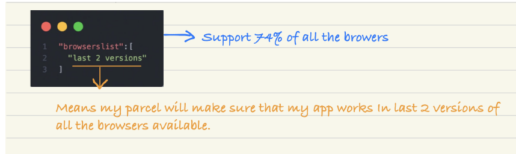

## Igniting Our App
1. **What is NPM?**
    + NPM works as a node package manager. It manages the packages but **it does not stand for node package manager**. Nowhere in the website, you will find it. For fun fact they just call it random stuff on the website.

    + NPM is a package management system for the javascript programming language. It allows developers to download, install and manage third-party packages, or software components for their projects. 

    + These packages can include everything from basic libraries and frameworks, to complex tools and utilities. npm makes it easy to keep track of and manage the dependencies of a project, ensuring that all required components are installed and up-to-date. 
2. **Configuring the Project:**
    ```
    npm init
    ```

    + It creates a `package.json` file.
    + Now to install parcel we will do:

    ```
    npm install -D parcel
    ```
    > **_-D_** is indicating that **dev dependency**, basically we are instructing NPM that install **_parcel_** but as a **dev** instead of **normal dependency**
    + Parcel is installing from that Node Package Manager which is on the remote.

    + Now we will get a `package-lock.json` file.
3. **What is Package.json file?**
    + `Package.json` file is a configuration for NPM. Whatever
    packages our project needs, we install those packages using
    ```
    npm install <packageName>
    ```
    + Once package installation is complete, their versions and
    configuration related information is stored as dependencies
    inside package.json file

4. **Why do we need this Package.json file ?**
    > Sometimes this packages are also known as dependencies.
    
     The `package.json` file is a crucial component in a Node.js project. Here are some reasons why it is needed:

    1. **Dependency Management**: The `package.json` file lists all the dependencies (both runtime and development) required by the project. This makes it easier to install and manage these dependencies using package managers like npm or yarn.

    2. **Version Control**: By specifying the versions of dependencies in the `package.json` file, you ensure that your project uses the correct versions to maintain consistency and avoid compatibility issues.

    3. **Scripting**: The `package.json` file allows you to define custom scripts such as build, test, start, etc. These scripts can be run using npm or yarn commands, making it easier to manage common tasks associated with the project.

    4. **Metadata**: The `package.json` file contains essential metadata about the project, such as the project name, version, description, author, license, etc. This information helps others understand the project and its requirements.
    
    In summary, the package.json file is essential for managing dependencies, defining scripts, providing project metadata, and enabling seamless integration with npm and other Node.js development tools.  

5. **What is package-lock.json?**
    + `Package-lock.json` locks the exact version of packages being used in the project.
    + It prevents our app to break on production by using **hash** 
    + It keeps a **hash** to verify that whatever is there in my dev machine right now, is the same version which is being deployed onto the production.
    + It keeps a track of all exact versions, of all the dependencies.  

6.  **What is difference between package.json and package.lock.json?**
    + In `package.json` we have information about generic version of installed packages whereas in `package-lock.json` we have information about the specific or exact version of installed packages.

7. **What is Bundlers?**

    A bundler is a tool that bundles our app, packages our app so that it can be shipped to production. Also, Bundlers are packages.
    
    Examples of Bundlers:
    * Webpack
    * Vite
    * Parcel

8.  **There is a two types of dependencies :**
    + Dev Dependency
        * when we are developing our app then we require that dev dependencies.
    + Normal Dependency
        * Normal dependencies are used in production.

9. **Difference between tilde ( ~ ) and caret ( ^ ) in package.json**
    + When we open our `package.json` file and search for the dependency property and in there we find the packages that are listed as a nested object of the dependency property `package-name:package-version`. Now look at the package version, we find some numbers separated by three dots. 

    + NPM versions follow a three-number format, separated by dots. The leftmost number signifies the major release, the second one represents the minor release, and the third number denotes the patch release of the package.

    + **Syntax:** The syntax of the npm version looks like the following.
        ```
        Major.Minor.Patch
        ```
    **Tilde (~) notation:** The tilde (~) notation is employed to match the latest patch version while freezing the major and minor versions. This notation is useful for automatically accepting bug fixes, considering that patch updates primarily address bugs.


    **Example:** 
    
    The `~1.2.0` will update all the future patch updates. We have to write just `~1.2.0` and all the next patch update dependencies. For example, 1.2.1, 1.2.2, 1.2.5……………1.2.x.

    > Note: Patch updates are very small security changes in a package that is why the ~version is approximately equivalent to the version.

    **Caret (^) notation:** It automatically updates both minor and patch updates.

    **Example:** 
    
    The `^1.2.4` will update all the future Minor and patch updates, for example, `^1.2.4` will automatically change the dependency to `1.x.x` if any update occurs. 
    > Using caret notation it is important to look at our code regularly if it is compatible with the newest version or not.

    

10. **What is node modules?**
    + Node modules basically fetches all the dependencies code into our system So, It is kind of like a database, where all our packages exists that needs in our project. 
    + Every dependency in `node_module` will have its `package.json`.
    + Node modules are very heavy so we should always put this in git ignore.

    >  NOTE: Never touch `node_modules` and `package-lock.json`

11. **I installed only _`parcel`_ then why all other dependencies has fetched into node modules folder?**
    + Because, as our project needs parcel, our project has a dependency parcel, now parcel as a project has its own dependencies and those dependencies can have its own dependencies, this is known as **`transitive dependencies`**.
    + So, Parcel needs a lot of other dependencies, that is why we have so many folders inside node modules folder. 

12. **Should I put `package.json` and `package-lock.json` into git, if _Yes_ then why?**
    + Yes, because `package.json` and `package-lock.json` maintains a note of, what all dependencies our project needs.

13. **Should I put `node_modules` into git, if _No_ then why?**
    + Node modules are very heavy & also can regenerate So, we should always put this in git ignore.
    + But do not forget to put `package.json` and `package-lock.json` into git, it is very important.
    + If we have `package.json` and `package-lock.json` then we can re-create all `node_modules` even if it is deleted.
    
        **By using :**
        ```
        npm install
        ```
14. **Difference between npm and npx :**
    + npx means executing a package 
    + npm commands are different if you have to install a package you need to write `npm install` then you install a package 

15. **What is the meaning of this command :**
    ```
    npx parcel index.html
    ```
    + `index.html` is a source file
    + we are executing the parcel
    + Basically, parcel goes to the source `index.html` and it generates a development build for our app and it hosts that development build to `localhost:1234`. So when it generates a development build it puts it up into the `dist` folder.  
    + Simply, we use it for starting the server.

16. **Why CDN is not a good way to use react?**

    + If I will fetch from CDN it will make a network call to `unpkg.com`and get react but if I already have react in my node modules then why would I make a another network call. That's why we install it.
    +  Today react version is 18 someother day it will be 19, 20 and so on. Now what will happen, we have to keep changing this `URL`. So it's better to have it inside our `package.json`. It is easier to manage all our dependencies and also react as one of the dependencies inside our npm `package.json`. 

17. **how to install react and react-dom?**
    ```
    together install: 
    ------------------
    npm i react react-dom
    "i stands for install"

    separate install :
    ---------------------
    npm install react 
    or 
    npm install react-dom
    ```

18. **How do I use that react into my code after deleting the CDN links?**
    + we will use keyword as `import` and importing the React & ReactDOM from react & react-dom/client respectively.
    ```
    import React from "react";
    import ReactDOM from "react-dom/client"
    ```  
    + All are coming from node modules.  

19. **Why getting this below error?**
    > Browser scripts cannot have imports or exports.
    + because browser understands this below script as regular js file :
    ```
        <script src="./App.js"></script>
    ```
    but when we add `type="module"` then browser react this script as a module not regular js file. 
    ```
        <script type="module" src="./App.js"></script>
    ```
20. **Hot Module Replacement (HMR):**
    + It means that parcel will keep a track of all the files which you are updating.
    + There is `File Watcher Algorithm` (written in C++). It keeps track of all the files which are changing realtime and it tells the server to reload.
    + These are all done by PARCEL

21. **Parcel-Cache folder:**
    + Parcel caches code all the time.
    + When we run the application, a build is created which takes some time in ms.
    + If we make any code changes and save the application, anotherbuild will be triggered which might take even less time than the previous build.
    + This reduction of time is due to parcel cache.
    + Parcel immediately loads the code from the cache every time there is a subsequent build.
    + On the very first build parcel creates a folder .parcelcache where it stores the caches in binary codeformat.
    + Parcel gives faster build, faster developer experience because of caching.

22. **Parcel features at a glance:**
    + Hot Module Replacement (HMR)
    + File Watcher Algorithm - C++
    + Bundling
    + Minify Code
    + Cleaning our code
    + Different Dev and production build
    + Super fast build algorithm
    + Image Optimization
    + Caching while development
    + Compression
    + Compatible with older browser versions
    + Https on dev
    + Image Optimization
    + Port No
    + Error Handling
    + Diagnostic
    + Consistency Hashing Algorithm
    + Zero Config
    + Tree Shaking

23. **Tree Shaking:**
    + Tree shaking is a process of removing the unwanted code that we do not use while developing the application.
    + In computing, tree shaking is a dead code elimination
    technique that is applied when optimizing code. 

24. **Remove this from Package.json :**
    ```
    "main": "App.js",
    ```
    + Because, We give the entry point like `index.html` while executing parcel. 
    + So, Parcel can conflicts with `"main": "App.js"`
     and will get error so remove  `"main": "App.js"`
    + Also, `Package.json` is automatically generated it for us.

25. **dist folder:**
    + It keeps the files minified for us.
    + When bundler builds the app, the build goes into a folder
    called dist.
    + The `/dist` folder contains the minimized and optimised
    version the source code.
    + Along with the minified code, the /dist folder also comprises of all the compiled modules that may or may not be used with other systems.

    When we run command:
    ```
    npx parcel index.html
    ```
    + This will create a faster development version of our project and serves it on the server.

    When I tell parcel to make a production build:
    ```
    npx parcel build index.html
    ```
    + It creates a lot of things, minify your file.
    + And the parcel will build all the production files to
    the dist folder.

26. **Browserslist:**
    + Browserslist is a tool that specifies which browsers should be supported/compatible in your frontend app.
    + It makes our code compatible for a lot of browsers.
    
    In `package.json` file do:
    
    
27. **Why your app is fast?**
    + because of react, bundlers and all other packages, all of are synced and makes react app fast. Not just react makes app fast.
    + bundlers like parcel, it minifies, optimize, tree shaking, code split, bundling, image optimization & compressing etc to the codes then our app becomes fast.

28. **What is `.gitignore`? What should we add and not add into it?**
    + `.gitignore` is a file where we mention file or folder names which we do not want to upload on github.
    + we can add :
        + node_modules
        + dist
        + `.parcel-cache`
    + we can't add :
        + `package.json`
        + `package-lock.json`    

29. **What is difference between vite, parcel & webpack?**
