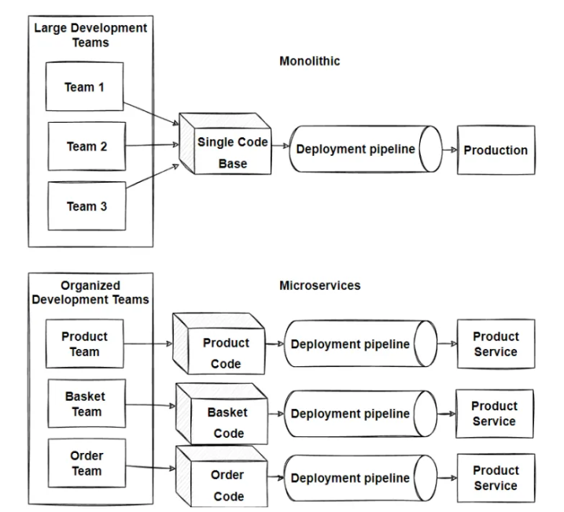
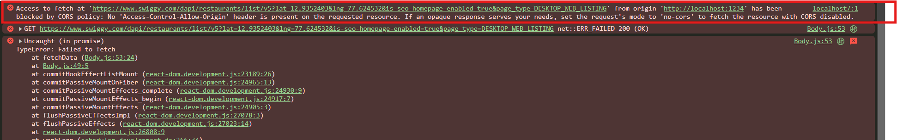
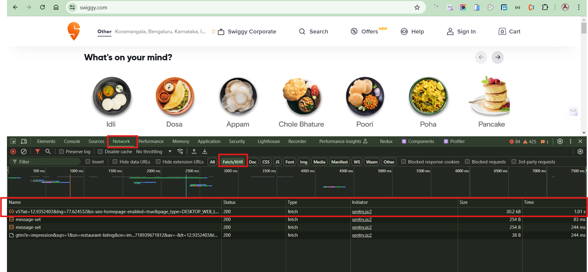
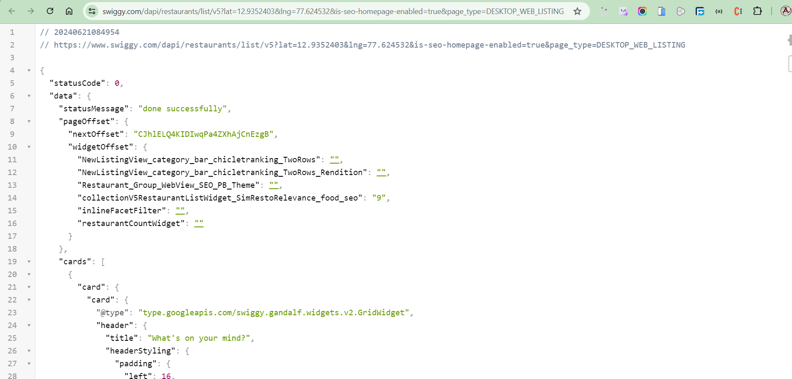

## Exploring the World

> 📢In today's episode, we discussed the trend towards 
lighter and more adaptable web architectures.

1. What are ‘Monolithic’ and ‘Microservices’ architectures exactly?
    + Understanding ‘Monolith’ and ‘Microservices’ architectures is a big deal in software development, but as developers, it's important to grasp the basics. So, 
    in this episode, we'll break it down into simple terms.

    + 

    **Monolith Architecture**

    + In the past, we used to build large projects where everything was bundled together. Imagine building an entire application where all the code—APIs, user interface, database connections, authentication, even notification services—resides in one massive project with single code base.
        + **Size and Complexity Limitation:** Monolithic applications become too large and complex to understand.
        + **Slow Startup:** The application's size can slow down startup time.
        + **Full Deployment Required:** Every update requires redeploying the entire application.
        + **Limited Change Understanding:** It's hard to grasp the full impact of changes,leading to extensive manual testing.
        + **Difficult Continuous Deployment:** Implementing continuous deployment is challenging.
        + **Scaling Challenges:** Different modules may have conflicting resource needs, making scaling difficulty.
        + **Reliability Concerns:** Bugs in any module can crash the whole application, affecting availability.
        + **Adoption of New Technologies:** Making changes in frameworks or languages is expensive and time-consuming since it affects the entire application.

    **Microservices Architecture**

    + The idea is to split your application into a set of smaller, interconnected services instead of building a single monolithic application. Each service handles a specific job, like handling user accounts or managing payments. Inside each service, there's a mini-world of its own, with its own set of rules (business logic) and tools (adapters). Some services talk to each other in different ways, like using REST or messaging. Others might even have their own website!
        + **Simpler Development:** Microservices break down complex applications into smaller, easier-to-handle services. This makes development faster and 
        maintenance easier.
        + **Independent Teams:** Each service can be developed independently by a team focused on that specific task.
        + **Flexibility in Technology:** Developers have the freedom to choose the best technologies for each service, without being tied to choices made at the project's start.
        + **Continuous Deployment:** Microservices allow for independent deployment, enabling continuous deployment for complex applications.
        + **Scalability:** Each service can be scaled independently, ensuring efficient resource usage.
        + **Separation of Concerns:** With each task having its own project, the architecture stays organized and manageable.
        + **Single Responsibility:** Every service has its own job, following the principle of single responsibility. This ensures focused and efficient development.

2. **Why Microservices?**
    + Breaking things down into microservices helps us work faster and smarter. We can update or replace each piece without causing a fuss. It's like having a well-oiled machine where each part does its job perfectly.

3. **How do these services interact with each other?**
 
    + In our setup, the UI microservice is written in React, which handles the user interface.
    
    
    + Advantage of Microservices that you can have different tech stack for different things.
        + suppose in `Monolith` you had a one big project a java application then you have to do everything in java.
        + But in this `Microservices Architecture`, 
            + you can have `UI` written in `React`.
            + you can have `Backend` written in `Java`.
            + you can have `DataBase` written in `Python`.
            + you can have `SMS` service written in `go-lang`.
        + you can write your micro services in any architecture you want.
    
    **Communication Channels**
        
    + These services interact with each other through various communication channels. 
    For instance, the UI microservice might need data from the backend microservice, which in turn might need to access the database
    
    **Ports and Domain Mapping**
        
    + Each microservice runs on its specific port. This means that different services can be deployed independently, with each one assigned to a different port. All these ports are then mapped to a domain name, providing a unified access point for the entire application.

    Example : 

    Suppose the `backend` is mapped to `slash` `api`
    ```
    namasteDev.com/api
    ```
    + All these services API are deployed onto the same URL.

    Example :

    Suppose, we can have `SMS` on `slash` `sms`
    ```
    namasteDev.com/sms
    ```
    + We can deploy the `UI` on `just slash` and so on.
    ```
    namasteDev.com/
    ```

    + As soon as it hits the main domain, it just redirects to this port 1234
     

    + These 1234, 1000, 3000 are the ports number.

> IMPORTANT 

+ They make a call to different URL's. Suppose if `UI` wants to connect to `backend`, they will make a call to `slash` `api`. So that's how these services are connected. and that's how they interact each other.

## Connecting to the External World
+ In this episode, we're going to explore how our React application communicates with the outside world. We'll dive into how our application fetches data and seamlessly integrates it into the user interface. It's all about understanding data exchange that makes our app come alive.

+ In our Body component, we're displaying a list of restaurants. Initially, we used mock data inside the `‘ useState() ’` hook to create a state variable. However, in this episode, we're stepping up our game by fetching real-time data from Swiggy's API and displaying it dynamically on the screen. How cool is that? 🤩


> **Very Important topic for Fast Loading**

**Before diving in, let's understand two approaches to fetch and render the data :**
1. **Load and Render:**
    + We can make the API call as soon as the app loads, fetch the data, and render it.
2. **Render First Fetch Later:**
    + Alternatively, we can quickly render the UI when the page loads we could show the structure of the web page, and then make the API call. Once we get the data, we re-render the application to display the updated information.
    + In React, we're opting for the second approach. This approach enhances user experience by rendering the UI swiftly and then seamlessly updating it once we receive the data from the API call.

    *Understand the concept from below image :*

    


**useEffect()**

Today, we're diving into another important topic `‘ useEffect() ’` We've mentioned it before in a previous episode. 

Essentially, `‘ useEffect() ’` is a Hook, React provides us, it is a regular JavaScript function, to help manage our components. 

To start exploring its purpose, let's first import it from React.
```
import { useEffect } from "react";
```
`useEffect()` takes two arguments .
+ Callback function.
+ Dependency Array.

**Syntax of useEffect()**
```
// We passed Arrow function as callback function.

useEffect(() => {}, []);
```

> `Parameters` are the variables defined in a function's declaration, while `Arguments` are the actual values passed to a function when it is called.

1. **When will the callback function get called inside the useEffect()?**

    + Callback function is getting called after the whole component get rendered.
    + In our app we are using `useEffect()` inside Body component. So it will get called once Body component complete its render cycle.

    + If we have to do something after the rendercycle complets we can pass it inside the `useEffect()`. This is the actual use case of useEffect. It is really helpful to render data which we will get after the `fetch()` operation and we are going to 
    follow second approach which we have discussed already. 

2. **Where we fetch the data?**
    + Inside the `useEffect()`, we use `fetchData()` function to fetch data from the external world. don’t worry we will see each and every steps in detail. 
    + logic of fetching the data is exactly the same that we used to do in javascript. 
    + here we are fetching the swiggy’s API by using `fetch()` method.

> 📢IMPORTANT:
If getting difficulty to understand `fetch()`, Don’t worry please read about how  `fetch()` works.
+ `fetch()` is given to us by browsers which JS engine has. 

https://developer.mozilla.org/en-US/docs/Web/API/Fetch_API/Basic_concepts

3. **How can we use Swiggys API in our App?**

    + We know that `fetch()` always returns a promise to us. we can handle response using `.then()` method.
    + but here we are using newer approach using `‘async/await’` to handle the promise.
    + we convert this data to javascript object by using `.json`.

    ```
    // here once the body component would have been rendered , we will fetch the data

    useEffect(() => {
    fetchData();
    }, []);

    const fetchData = async () => {
    const data = await fetch(
        "https://www.swiggy.com/dapi/restaurants/list/v5?lat=19.9615398&lng=79.2961468&is-seo-homepage-enabled=true&page_type=DESKTOP_WEB_LISTING"
    );
    const json = await data.json();
    console.log(json);
    };
    ```
4. By using above code let’s see can we able to call swiggy’s api sucessfully or not?
    + We got an error 😅 
    + 

5. **What is the reasone we got that error?**

    + Basically calling swiggy’s API from local host has been blocked due to CORS policy. 
6. **What exactly the CORS policy is?**

    + (Cross-Origin Resource Sharing) is a system, consisting of transmitting HTTP headers, that determines whether browsers block frontend JavaScript code from accessing responses for cross-origin requests.

    + In simpler terms, CORS (Cross-Origin Resource Sharing) is a security feature implemented by browsers that restricts web pages from making requests to a different origin (domain) than the one from which it was served. Therefore, when trying to call Swiggy's API from localhost, the browser blocks the request due to CORS restrictions.
        
        > IMPORTANT:
        If getting difficulty to understand CORS, Don’t worry please read the below document.

        https://developer.mozilla.org/en-US/docs/Glossary/CORS

        > IMPORTANT!
        To prevent CORS errors when using APIs, utilize a CORS extension and activate it.

        > 📢IMPORTANT! 
        In future swiggy definately change their API data so always remember go to swiggy’s website and copy the updated URL of API to fetch data.

    + To show the new data on our page, we just need to update the `listOfRestaurant` with the fresh info. React will then refresh the page to display the updated data.

7. **How do we Update the data ?**

    + We're updating the `listOfRestaurant` using a state variable we've already defined. We simply use the `setlistOfRestaurant()` function to replace the old data with the new.

    ```
    const fetchData = async () => {
    const data = await fetch(
        "https://www.swiggy.com/dapi/restaurants/list/v5?lat=19.9615398&lng=79.2961468&is-seo-homepage-enabled=true&page_type=DESKTOP_WEB_LISTING"
    );
    
    const json = await data.json();
    setListOfRestaurant(
        json.data.cards[4].card.card.gridElements.infoWithStyle.restaurants
    );
    };
    ```
        > IMPORTANT:
        As we delve into the JSON data, it's essential to note its complexity. Our focus lies solely on extracting cards which have restaurant information for our project.

        Attempting to directly implement the code snippet provided here definitely results in errors due to potential changes in Swiggy's API structure. Your understanding is greatly appreciated during this phase. Focus on the concept of whatever Akshay taught us in this Episode. 

        NOTE: In the upcoming episode, ‘Akshay’ addresses all API-related issues, ensuring a smoother experience. So, don't stress—everything will be resolved in the upcoming episode.

        Happy coding!

8. **How to get an `API`?**

    + Open the website of swiggy
    + Go to `Network Tab` 
    + select the `Fetch/XHR`
    + Reload the website
    + Cool - you will see the link under the `name` coloumn 
        + confirm by checking these things 
            + `type` : fetch
            + `Size` : should be in `KB`
            + `Name` : start with `object symbol` &  name `v5` or something else
    + Just double click on the `Name` , it will open in new tab
    + Congrats, got the data.
    > Below images are just for reference.
    + 
    + 