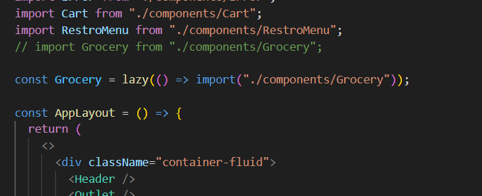

## Optimizing Our App

**Modularity**

Modularity means that you break down your code into different different small modules, so that your code becomes more maintainable and more testable   

## Custom Hooks

Creating a custom hook is not a mandatory thing, but it is a very good thing because 
+ that will make your code look, more good readable, 
+ that will make your code more modular, 
+ that will make your code more reusable. 
So, that is the use of creating custom hooks.

Suppose, we have `RestroMenu` component and it is currently concerned about two things :
+ fetching data
+ displaying on the UI

But we want that `RestroMenu` should be only concerned about displaying on the UI. So here custom hook comes into the picture, now abstract fetching data logic part from the `RestroMenu` and put inside the custom hook.   
So `RestroMenu` component will be more readable and modular.

> We will just take out some responsibility from a component and extract it inside a hook. So that our hook and our component becomes more modular.

--------
**Creating a custom hook named as `useRestroMenu hook`**

This custom hook will fetch the data and we will give it to `RestroMenu`.
So, `RestroMenu` will not have to worry about how we are fetching the data.

> Always prefer to create a separate file for a separate hook.
Best place to store a custom hook is `utils` folder.

Example : this is the abstraction of fetching data from the `RestroMenu`
```
import React, { useEffect, useState } from "react";
import { RES_MENU_API } from "./constants";

const useRestroMenu = (resId) => {
  const [resMenuInfo, setResMenuInfo] = useState([]);

  useEffect(() => {
    fetchData();
  }, []);

  const fetchData = async () => {
    const data = await fetch(RES_MENU_API + resId);
    const json = await data.json();
    console.log(json.data);
    setResMenuInfo(json.data);
  };
  return resMenuInfo;
};

export default useRestroMenu;
```
Example : this is how we use the custom hook named as `useRestroMenu` inside the `RestroMenu`.
```
  const resInfo = useRestroMenu(resId);
```
> Now, this is how my `RestroMenu` is following a single responsibility principle.
single responsibility principle means to be concerned about only one responsibility.

**_General Steps :_**

Creating a custom hook in React involves a few steps. Here's a general guide to help you create a custom hook:

1. **Define the Hook Function**: Create a JavaScript function that will serve as your custom hook. Custom hooks typically start with the word "use" to follow the convention. For example, you could name your custom hook function as `useCustomHook`.

2. **Determine the Hook Logic**: Decide on the logic your custom hook will encapsulate. This could be anything from handling state, fetching data, event listeners, or any other reusable logic.

3. **Code the Custom Hook**: Write the logic within your custom hook function. You can use existing React hooks within your custom hook if needed.

4. **Return Values**: Ensure your custom hook returns the necessary values, functions, or variables that components using the hook will need.

5. **Using Dependencies**: If your custom hook depends on external libraries or resources, make sure to include them in the hook file.

6. **Testing**: Test your custom hook by using it in a React component to see if it functions as expected.

Here's a simple example of a custom hook that manages a state variable and provides functions to update that state:

```jsx
import { useState } from 'react';

const useCustomHook = (initialState) => {
  const [value, setValue] = useState(initialState);

  const updateValue = (newValue) => {
    setValue(newValue);
  };

  return {
    value,
    updateValue,
  };
};

export default useCustomHook;
```

To use this custom hook in a component:

```jsx
import React from 'react';
import useCustomHook from './useCustomHook';

const MyComponent = () => {
  const { value, updateValue } = useCustomHook(0);

  return (
    <div>
      <p>Value: {value}</p>
      <button onClick={() => updateValue(value + 1)}>Increment</button>
    </div>
  );
};

export default MyComponent;
```

Remember, custom hooks help in keeping your code organized and promoting reusability.  

1. **I want to create a custom hook but I don't know how to start writing it, how to think, how to write, my thoughts in the code?**
    
    + first thing you should finalize the contract.

2. **what do you mean by contract?**
    + what is the input of that hook & what is the output of that hook.
    + just like `useRestroMenu`, we had a `resId` as input and `resInfo` as output.
    + So, when you know these two things input & output then it becomes easier to write your hook.
    
## Optimize Large Scale Application By Code Splitting

1. **Why Break Down a Large-Scale Application into Smaller Bundles**

    - **Importance**: 
      - Bundlers consolidate multiple files into a single file for deployment.
      - While suitable for small projects, large applications can suffer from slower loading times due to the increased file size.

    - **Benefits of Breaking Down into Smaller Chunks**:
      - Optimization of performance and loading times.
      - Improved efficiency in managing and loading code.
      
    - **Terms for the Process**:
      - Chunking
      - Code Splitting
      - Dynamic Bundling
      - Lazy Loading
      - On-demand Loading
      - Dynamic Import
      
    - **Actions Required**:
      - Divide the application into smaller logical chunks.
      - Split the codebase effectively for better organization.
      
    - **Conclusion**:
      - Breaking down a large-scale application into smaller bundles is crucial for enhancing performance, optimizing loading times, and ensuring smooth functionality.
    
2. **When to make smaller bundles?**

+ Take a example of `makemytrip` 
  + `makemytrip` application have thousands of bundles and there are 10 different things like flight, hotels, trains, homestays, hotels etc.
  + Each flight has 100 components so that 100 components can form one bundle, hotels can form one bundle, homestays can form one bundle with all the components. So similarly you can logically break down you application into smaller smaller applications.
  + So, if we see these smaller applications are within a big application.
  + This is how we can logically split our website into smaller bundles.
  
  + So that we don't put a load on a single bundle so that our request for that js file does not become so heavy that it takes a lot of times to get into the browser.

3. **How can we build these separate logical bundles in our app?**

    Let's take a example to made a **Grocery items** in our app.

    + Make a different folder and list out all the related component like home, menu, about us etc.
    + Connect with Link from react router dom.
    + We will not `import` `Grocery items` normal in our `App.js` as we import.
    + We will import through `Lazy()`.
      + Because, when our app will load initially, our app home page will load, it will not load the code for grocery. Only when we go to my grocery page then only that grocery code will be there in our app.
    + So, That is known as lazy loading. We will not load everything directly but we will do a lazy loading when required.

    + `lazy()` is a function which is given to us by react. Import as Named export.
    + *lazy()* takes a callback function and this callback function uses this `import function` which takes a path of that component which we want to be on-demand.

      Example : 
      > We write it outside of the function in the `App.js`
      
      
      ```
      const Grocery = lazy(() => import("./components/Grocery"));
      ```
      In this above example, we have written the variable name `Grocery` in capital because this is component, not a function name.

      Basically we have taken the path & var name from this below import (normal import).
      ```
      // import Grocery from "./components/Grocery";
      ```

**lazy()**
---   
The `lazy()` function is a feature in React that allows us to  _`load components dynamically, or lazily, only when they are needed`_. This can be beneficial for improving the performance and load times of our web application, especially if it contains a large number of components or if some components are rarely used. Here's when and why we might need to use lazy():

1. **Code Splitting and Reducing Initial Bundle Size**: In large React applications, bundling all components into a single JavaScript file can result in a large initial 
bundle size. This can lead to slower load times for users. By using lazy(), we can split our code into smaller, more manageable chunks. These chunks are loaded on-demand, reducing the initial bundle size and improving the time it takes for our application to load.

2. **Improved Performance**: Lazy loading can lead to better application performance. Components that are only loaded when needed reduce the amount of code that needs to be executed during the initial page load, which can lead to faster rendering times and a smoother user experience.

3. **Faster Initial Load**: When we use lazy(), only the essential code is loaded initially. Less code to parse and execute means that our application can start up faster, especially in scenarios where not all components are used right away.

4. **Better User Experience**: By deferring the loading of components until they are needed, we can provide a more responsive user experience. Users don't have to wait for unnecessary components to load, and they can interact with the 
parts of the application that are immediately visible.

5. **Reducing Browser Caching Overhead**: Smaller initial bundles produced by lazy() can also benefit from browser caching. Since components are loaded as separate chunks, once loaded, they are less likely to change frequently. This can result in a better caching strategy and faster subsequent visits to our site for returning users.

6. **Optimizing Mobile Performance**: On mobile devices with limited bandwidth and processing power, lazy loading is even more important. Smaller initial bundles can make our application more accessible and usable on mobile devices.

    > 📌Here's an example of how to use lazy() to load a component dynamically :

    ```
    import React, { lazy, Suspense } from 'react';
    
    const LazyComponent = lazy(() => import('./LazyComponent'));
    
    function App() {
      return (
        <div>
          <Suspense fallback={<div>Loading...</div>}>
            <LazyComponent />
          </Suspense>
        </div>
      );
    }
    export default App;
    ```
In this example, the  `LazyComponent`  is only loaded when it is rendered. 
The  `Suspense`  component allows us to specify a loading indicator while the component is being loaded. This way, we can ensure a smooth user experience even during the asynchronous loading process.

In summary, we need to use lazy() when we want to optimize the performance and user experience of our React application by reducing the initial bundle size and deferring the loading of components until they are needed. This is particularly beneficial in large applications or when targeting slower connections and devices.

**Suspense** 
---
In React, `Suspense` is a feature that allows us to declaratively manage asynchronous data fetching and code-splitting in our applications. It is primarily used in combination with the lazy() function for dynamic imports and with the React.lazy() component to improve the user experience when loading data or components asynchronously.

*`Here are the main aspects and use cases of Suspense:`*

**Data Fetching**: Suspense can be used to handle the loading of asynchronous data, such as data from an API. It provides a way to specify a fallback UI (e.g., a loading spinner or a message) that is displayed while the data is being fetched. This is especially useful for making our application more user-friendly and responsive.

**Code Splitting**: When used with lazy() or React.lazy(), Suspense can manage the loading of code-split components. We can specify a fallback component or loading indicator to display while the component is being loaded. This helps in 
reducing the initial bundle size and improving the application's performance.

**Error Handling**: Suspense can also handle errors that might occur during data fetching or code splitting. We can specify how to render an error component or message in case an error occurs during the asynchronous operation.

> 📌Here's a basic example of using Suspense for data fetching:

```
import React, { Suspense } from 'react';

const fetchData = () => {
  return new Promise((resolve) => {
    setTimeout(() => {
      resolve("Data fetched!");
    }, 2000);
  });
};

function DataFetchingComponent() {
  const data = fetchData();
  return (
    <div>
      <Suspense fallback={<div>Loading data...</div>}>
        <AsyncDataComponent data={data} />
      </Suspense>
    </div>
  );
}

function AsyncDataComponent({ data }) {
  return <div>{data}</div>;
}
```
In this example, when the  DataFetchingComponent  is rendered, it starts fetching data asynchronously. The Suspense component wraps the AsyncDataComponent, specifying a fallback UI to display while the data is being fetched.

Suspense can also handle errors by using an error boundary. If an error occurs during data fetching or code-split component loading, we can catch and handle the error gracefully.

While Suspense simplifies managing asynchronous operations and loading states in our React application, it's essential to be aware of the version of React we are using. Suspense for data fetching was introduced in React 18 and may have different usage patterns compared to Suspense for code-splitting, which has been available since React 16.6. Depending on the version of React, we might need to adjust our code accordingly.

1. **Why do we get this error: *`A component was suspended while responding to synchronous input. This will cause the UI to be replaced with a loading indicator. To fix this, updates that suspend should be wrapped with start transition ?`* How does suspense fix this error?**

    The error message you provided, "A component was suspended while responding to synchronous input. This will cause the UI to be replaced with a loading indicator. To fix this, updates that suspend should be wrapped with start transition," is related to React's Suspense feature and is typically encountered in asynchronous contexts where components are fetching data or handling code splitting.

    To understand this error and how to fix it, you need to know a bit about how Suspense works and why it's important. Suspense is used to manage asynchronous data fetching and code-splitting, allowing you to display a loading indicator while the data or code is being fetched. When React encounters a Suspense boundary (created using ), it knows that there might be a delay in rendering, and it can handle that situation gracefully.

    The error message you received is telling you that a component that was responding to synchronous input (meaning it's not supposed to be waiting for anything) encountered a suspension. This should not happen because Suspense is primarily designed to handle asynchronous operations, and you generally don't 
    want to introduce delays in the rendering of synchronous user interactions.

    > 💡Here's how to fix this error:

    **Identify the Issue**: You should identify which part of your code is causing the synchronous component to suspend. This could be due to a network request, a dynamic import of a component, or another asynchronous operation.
    **Wrap Asynchronous Code**: Ensure that the asynchronous code, which might suspend, is wrapped within a Suspense boundary (using ) and that you provide a fallback UI to display while waiting for the operation to complete.

    > 📌Here's an example of how to properly structure your code:

    ```
    import React, { Suspense, lazy } from 'react';

    const AsyncComponent = lazy(() => import('./AsyncComponen
    t'));
    
    function App() {
      // Synchronous code
      return (
        <div>
          <h1>Your App</h1>
          <Suspense fallback={<div>Loading...</div>}>
            <AsyncComponent />
          </Suspense>
        </div>
      );
    }
    export default App;
    ```
    In this example, the AsyncComponent is loaded asynchronously, and it is wrapped within a boundary. The fallback attribute specifies what to display while the component is loading. The rest of the application, which is synchronous, doesn't get affected and will continue to respond to user input without unnecessary delays.

    Suspense helps in maintaining a smooth and responsive user experience by handling asynchronous operations gracefully and ensuring that synchronous interactions are not interrupted by loading indicators.

2. **When do we and why do we need suspense ?**
React Suspense is a feature introduced in React to help manage asynchronous operations, such as data fetching and code splitting, in a more declarative and user-friendly manner. You need to use Suspense in your React application when you want to:

    *`Improve User Experience`*: Suspense helps in providing a better user experience by managing the loading state of asynchronous operations. Instead of showing loading spinners or handling loading states manually, Suspense allows you to 
    specify fallback UI components to be displayed while data is being fetched or code is being loaded.

    *`Optimize Performance`*: Suspense, in combination with code splitting, can significantly improve the performance of your application. It allows you to load code and data only when it's needed, reducing the initial bundle size and making 
    your application faster to load.

    *`Simplify Code`*: Suspense simplifies your code by providing a more declarative way to handle asynchronous operations. It reduces the need for complex state management and error handling for data fetching or code splitting.

    *`Avoid Callback Hell`*: In traditional async patterns, managing multiple asynchronous operations can lead to "callback hell" or nested promises. Suspense provides a more structured way to handle multiple asynchronous operations concurrently.

    *`Error Handling`*: Suspense is also useful for handling errors gracefully. You can specify how to render error components or messages when an error occurs during data fetching or code splitting, making it easier to provide a clear user-facing error message.

    Here's a brief overview of when and why you might need Suspense in different scenarios:

    *`Data Fetching`*: Use Suspense for data fetching when you want to make your application more responsive and provide a smooth loading experience for data-driven components. It simplifies the management of loading states and error 
    handling.

    *`Code Splitting`*: Use Suspense for code splitting when you want to improve your application's initial load time and performance. It allows you to load parts of your application on-demand, which can lead to faster rendering times and better 
    resource usage. Concurrent Mode:

    React Suspense is particularly valuable when using React Concurrent Mode. Concurrent Mode leverages Suspense to handle asynchronous rendering and data fetching more concurrently and efficiently.

    In summary, you need to use Suspense in React when you want to create a more responsive, efficient, and user-friendly application by simplifying the handling of asynchronous operations and providing a better user experience during data 
    fetching and code splitting.

Advantages and Disadvantages of using this code splitting pattern 
---

Code splitting is a technique used to break down a large 
monolithic JavaScript bundle into smaller, more manageable 
pieces, which can be loaded on-demand. This pattern has 
several advantages and some potential disadvantages, 
depending on how it's implemented and the specific use case. 
Let's explore the advantages and disadvantages of using code 
splitting:

**Advantages:**

*`Faster Initial Load Time`*  Smaller initial bundles result in faster load times for your web application. Users can start interacting with the application sooner because they don't have to download unnecessary code.

*`Improved Performance`*: Code splitting can lead to better performance, as smaller bundles can be parsed and executed more quickly. This can reduce the time it takes to render the initial page and improve the overall responsiveness of the 
application.

*`Optimized Resource Usage`*: Code splitting helps optimize resource usage. Components or features that are rarely used may never be loaded unless needed. This conserves bandwidth and memory, making your application more efficient.

*`Enhanced Caching`*: Smaller bundles can benefit from browser caching. Since they are less likely to change frequently, browsers can cache them, resulting in faster subsequent visits for returning users.

*`Simpler Maintenance`*: Smaller bundles are easier to maintain. When you make updates to specific parts of your application, you can be more confident that you won't introduce unexpected issues in unrelated components.

*`Better Mobile Performance`*: On mobile devices with limited bandwidth and processing power, code splitting can significantly enhance the user experience by reducing the amount of data that needs to be loaded and processed.

**Disadvantages:**

*`Complex Configuration`* : Setting up code splitting and configuring it correctly can be complex, especially in large applications. You may need to make adjustments to your build tools and bundler settings.

*`Initial Loading Delay`*: When a component is loaded on-demand, there may be a slight delay the first time it is needed, which can impact user perception of your application's speed. However, this delay is usually minimal, and it's often a trade-off for the benefits of code splitting.

*`Asynchronous Loading`*: Handling asynchronous loading and rendering of components requires careful design to ensure a seamless user experience. You need to consider scenarios such as loading indicators and error handling.

*`Route-Based Splitting`*: To maximize the benefits of code splitting, you should implement it on a route or feature basis. This can lead to a more granular structure, but it may require some restructuring of your application.

*`Tool and Framework Support`*: Not all frameworks and libraries have built-in support for code splitting. You may need to rely on specific tools and configurations, which can vary depending on your stack.

*`Testing Complexity`*: Testing code-split components can be more challenging because you must ensure that they load correctly in different scenarios and that they don't introduce unexpected issues.

In summary, code splitting is a valuable technique for improving the performance and user experience of your web applications, but it comes with some complexities and trade-offs. The advantages, especially in terms of faster initial load times and optimized resource usage, often outweigh the disadvantages,which can be mitigated with careful implementation and testing.


